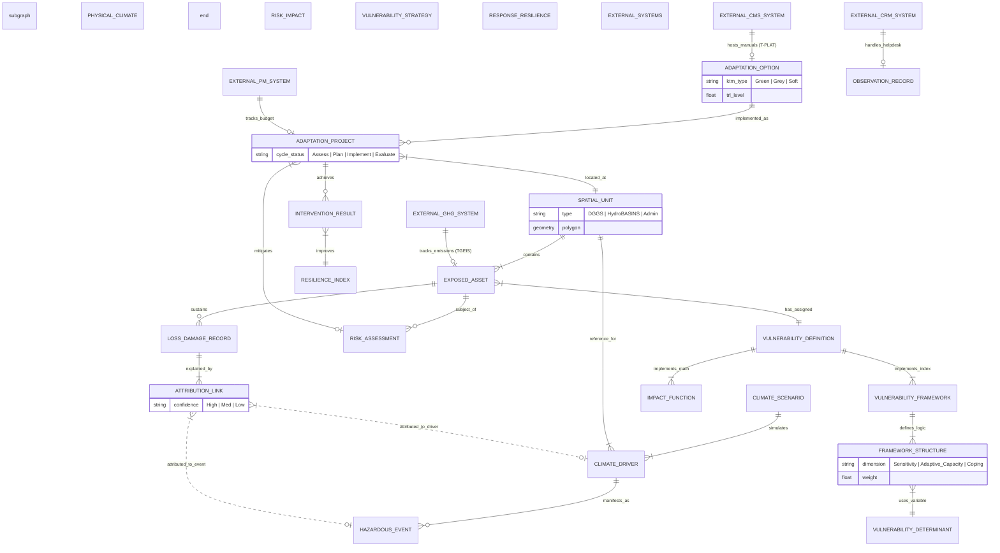

# Detailed Design: Conceptual Data Model (CDM) for Climate Risk & Adaptation

## 1. Overview
This design refines the existing CDM to support the National Climate Adaptation Information Framework (NCAIF) as mandated by the TOR. It bridges scientific rigor (IPCC, WMO) with policy implementation (ISO 14090, NAP).

## 2. Subject Area Specifications

### A) Physical Climate (The Cause)
*Focus: Harmonizing continuous trends and discrete shocks.*
- **`CLIMATE_DRIVER` (Stressors):** Based on IPCC CID and GCOS ECVs. Attributes include domain (Atmosphere/Land/Ocean), spatial/temporal resolution, and uncertainty estimates.
- **`HAZARDOUS_EVENT` (Shocks):** Discrete occurrences with WMO-CHE UUIDs.
- **`CLIMATE_SCENARIO`:** Projections (SSP/RCP) from CMIP6 models.

### B) Risk & Impact (The Product)
*Focus: Deterministic loss accounting and probabilistic risk modeling.*
- **`SPATIAL_UNIT`:** Supports **DGGS** (Global Grid) and **HydroBASINS** (Topological) for multi-purpose analysis.
- **`EXPOSED_ASSET`:** Societal elements (Population, Infrastructure) mapped to GED4ALL taxonomies.
- **`ATTRIBUTION_LINK`:** A polymorphic bridge allowing a `LOSS_DAMAGE_RECORD` to be explained by either a `HAZARDOUS_EVENT` or a `CLIMATE_DRIVER` with a `confidence_level`.
- **`RISK_ASSESSMENT`:** Implements the INFORM hierarchy ($Risk = f(Hazard, Exposure, Vulnerability)$).

### C) Vulnerability & Resilience (The Mechanism)
*Focus: The "Strategy Pattern" for heterogeneous data.*
- **`VULNERABILITY_DEFINITION`:** Acts as a dispatcher.
    - **`IMPACT_FUNCTION`:** Math-based (Depth-Damage curves) for actuarial risk.
    - **`VULNERABILITY_FRAMEWORK`:** Indicator-based (Coping/Adaptive Capacity) for policy scores.
- **`VULNERABILITY_DETERMINANT`:** A neutral library of social/economic indicators (e.g., Poverty Rate, Literacy).

### D) Knowledge & Adaptation (The Action)
*Focus: Tracking the Adaptation Cycle (ISO 14090).*
- **`ADAPTATION_OPTION`:** The "Library" of solutions categorized by **KTM** (Green, Grey, Soft).
- **`ADAPTATION_PROJECT`:** Specific implementations. Attributes track status through the cycle: *Assess -> Plan -> Implement -> Evaluate*.
- **`INTERVENTION_RESULT`:** SMART KPIs measuring the effectiveness of projects.

## 3. ERD: National Climate Adaptation Information Framework (NCAIF)

## 4. Key Design Decisions & Logic
1.  **The "Universal Adapter" (Attribution Link):** Solves the "Slow-Onset" problem identified in Source 1. It allows loss records to link to continuous drivers (Sea Level Rise) without faking a "start/end date" event.
2.  **Polymorphic Vulnerability:** The database schema remains stable whether calculating math-heavy flood damage (CLIMADA) or socio-economic resilience scores (National CRI).
3.  **ISO 14090 Lifecycle:** By tracking the `cycle_status` of projects, the CDM supports the "System of Systems" approach where monitoring data (Evaluation) feeds back into the next risk assessment (Assess).
4.  **Spatial Multi-Tenancy:** By allowing `SPATIAL_UNIT` to be a DGGS cell or a HydroBASIN, the model supports both engineering precision and natural boundary logic.
