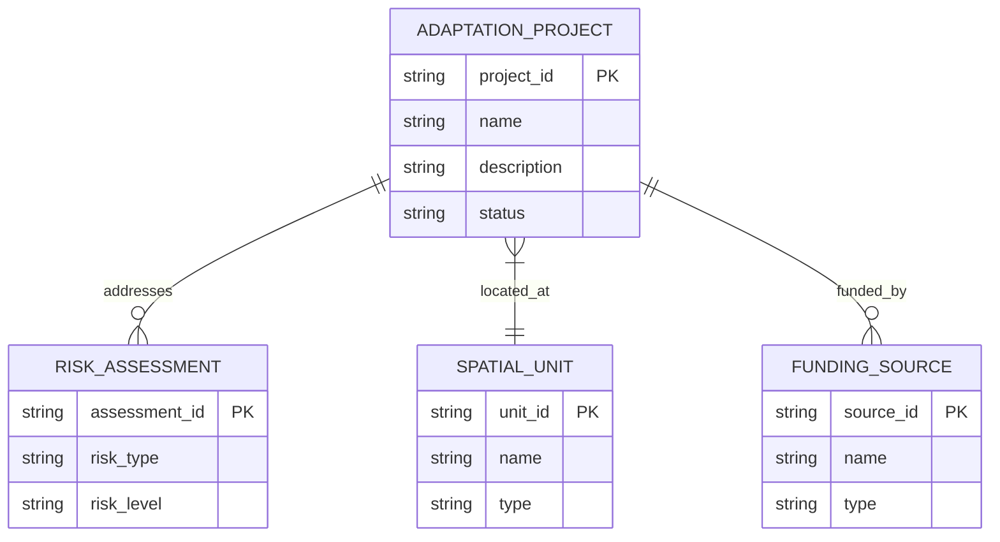
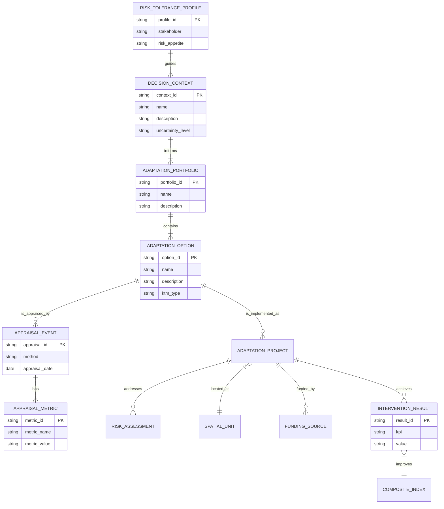

# Adaptation Planning Subject Area Design Options

## Option 1: Minimum Viable Design

This design focuses on the core entities required to support DCCE's immediate needs for adaptation planning, based on existing data and established workflows.

### Key Entities

*   **`ADAPTATION_PROJECT`**: The central entity, representing a specific adaptation intervention.
*   **`RISK_ASSESSMENT`**: Links the adaptation project to the specific climate risk it is designed to address.
*   **`SPATIAL_UNIT`**: Defines the geographic location of the project.
*   **`FUNDING_SOURCE`**: Tracks the financial resources for the project.

---

## Option 2: Ideal Workflow Design (ISO/IPCC/UNDRR-aligned)

This design incorporates a more comprehensive set of entities and relationships to support a best-practice adaptation planning lifecycle, aligned with international standards.

### Key Enhancements

*   **`DECISION_CONTEXT`**: Frames the adaptation problem and its uncertainty.
*   **`RISK_TOLERANCE_PROFILE`**: Captures stakeholder risk appetite to guide decision-making.
*   **`ADAPTATION_PORTFOLIO`**: Allows for the evaluation of bundles of adaptation options.
*   **`ADAPTATION_OPTION`**: A library of potential solutions, decoupled from specific projects.
*   **`APPRAISAL_EVENT` & `APPRAISAL_METRIC`**: Creates a detailed and transparent record of the project evaluation process.
*   **`INTERVENTION_RESULT`**: Tracks the performance of implemented projects.
*   **`COMPOSITE_INDEX`**: Connects project outcomes back to resilience indicators.
