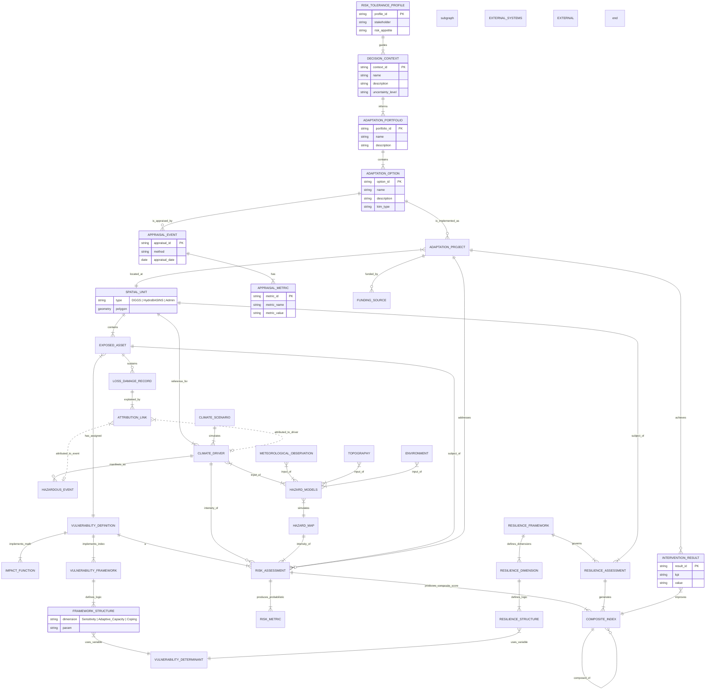

# Detailed Design: Conceptual Data Model (CDM) for Climate Risk & Adaptation

 
## 1. Overview
This design refines the existing CDM to support the National Climate Adaptation Information Framework (NCAIF). It bridges scientific rigor (IPCC, WMO) with policy implementation (ISO 14090, NAP).

## 2. Subject Area Specifications

### Subject Area 1: Physical Climate (The Cause)

_Focus: From raw observations to drivers._

- **`CLIMATE_DRIVER` (Stressors):** Based on IPCC CID and GCOS ECVs. Attributes include domain (Atmosphere/Land/Ocean), spatial/temporal resolution, and uncertainty estimates.
    
- **`CLIMATE_SCENARIO`:** Projections (SSP/RCP) from CMIP6 models that simulate drivers.
    
- **`HAZARDOUS_EVENT` (Shocks):** Discrete occurrences (e.g., a specific cyclone) with WMO-CHE UUIDs.
    

### Subject Area 2: Risk & Impact Assessment (The Calculation)

_Focus: The core engine combining Hazard, Exposure, and Vulnerability._

#### 2.1 Hazard Modeling

- **`HAZARD_MODELS`:** The computational engines.
    
    - _Inputs:_ `CLIMATE_DRIVER`, `METEOROLOGICAL_OBSERVATION`, and static environmental data (`TOPOGRAPHY`, `ENVIRONMENT`).
        
- **`HAZARD_MAP`:** The spatial output of a model (e.g., flood depth grid) used to determine intensity at a specific location.
    

#### 2.2 Vulnerability & Exposure

- **`SPATIAL_UNIT`:** The geometric foundation (DGGS, HydroBASINS, Admin).
    
- **`EXPOSED_ASSET`:** Societal elements (Population, Infrastructure) mapped to GED4ALL taxonomies.
    
- **`VULNERABILITY_DEFINITION`:** The abstract definition of a vulnerability curve or index.
    
    - **`IMPACT_FUNCTION`:** Math-based (e.g., Depth-Damage curves) for actuarial calculations.
        
    - **`VULNERABILITY_FRAMEWORK`:** Indicator-based (e.g., Social Vulnerability Index) for policy scoring.
        
- **`FRAMEWORK_STRUCTURE`:** The logic layer mapping a generic variable to a specific framework dimension (e.g., mapping "Poverty Rate" to "Sensitivity").
    
- **`VULNERABILITY_DETERMINANT`:** A neutral library of social/economic indicators used as variables.
    

#### 2.4 Risk Assessment Outputs

- **`RISK_ASSESSMENT`:** The event of running a calculation.
    
- **`RISK_METRIC`:** Probabilistic, quantitative outputs (e.g., Average Annual Loss) derived from `IMPACT_FUNCTION`.
    
- **`COMPOSITE_INDEX`:** Qualitative or normalized scores (1-10) derived from `VULNERABILITY_FRAMEWORK`.
    

#### 2.5 Impact (Loss & Damage)

- **`LOSS_DAMAGE_RECORD`:** Historical data on actual impacts sustained by assets.
    
- **`ATTRIBUTION_LINK`:** A polymorphic bridge connecting a Loss Record to either a `HAZARDOUS_EVENT` (discrete) or a `CLIMATE_DRIVER` (slow-onset).
    

### Subject Area 3: Resilience Assessment (The Capacity)

_Focus: Hierarchical scoring of adaptive capacity (distinct from physical risk)._

- **`RESILIENCE_FRAMEWORK`:** The governing methodology (e.g., "National Community Resilience Index").
    
- **`RESILIENCE_DIMENSION`:** The thematic pillars (e.g., Social, Economic, Institutional).
    
- **`RESILIENCE_STRUCTURE`:** Defines the weighting and aggregation logic for specific determinants within a dimension.
    
- **`RESILIENCE_ASSESSMENT`:** The application of a framework to a spatial unit to generate a `COMPOSITE_INDEX` (supports recursive index-of-indices).
    

### Subject Area 4: Adaptation Planning (The Action)
[[Adaptation_Planning_CDM_Options]]

_Focus: The ISO 14090 Adaptation Cycle and iterative decision support._

- **`DECISION_CONTEXT`:** Defines the scope, problem, and uncertainty level for adaptation planning.

- **`RISK_TOLERANCE_PROFILE`:** Captures stakeholder risk appetite to guide decision-making.

- **`ADAPTATION_PORTFOLIO`:** Groups multiple `ADAPTATION_OPTION`s for collective evaluation.

- **`ADAPTATION_OPTION`:** A library of potential solutions (Green, Grey, Soft) decoupled from specific projects.

- **`APPRAISAL_EVENT`:** Records the process of evaluating adaptation options (method, date).

- **`APPRAISAL_METRIC`:** Detailed key-value pairs representing the outcomes of an appraisal (e.g., CBA ratio, social acceptance score).

- **`ADAPTATION_PROJECT`:** Specific implementations of an `ADAPTATION_OPTION` at a `SPATIAL_UNIT`.
    - _Linkage:_ Projects are explicitly "informed by" `RISK_METRIC` and `COMPOSITE_INDEX` results.

- **`INTERVENTION_RESULT`:** SMART KPIs measuring project effectiveness.
    - _Feedback Loop:_ Results link back to `COMPOSITE_INDEX`, showing how a project improves a score.
## 3. ERD for National Climate Adaptation Information Framework (NCAIF)

## 4. Key Design Decisions & Logic 

### Data Structure & Reusability Logic

1. **Determinant Neutrality (The "Build Once, Use Everywhere" Pattern):**
    - _Logic:_ `VULNERABILITY_DETERMINANT` is a standalone library of indicators (e.g., "Poverty Rate") that feeds into _both_ `FRAMEWORK_STRUCTURE` (Vulnerability) and `RESILIENCE_STRUCTURE` (Resilience).
        
    - _Decision:_ The system treats socio-economic data as neutral "facts." The _meaning_ of that fact (e.g., is it a "sensitivity" or a "coping capacity"?) is only applied later via the Framework mapping. This prevents data duplication across different policy domains.
        
2. **Recursive Aggregation:**
    - _Logic:_ The `COMPOSITE_INDEX` entity has a self-referencing relationship (`composed_of`).
        
    - _Decision:_ The system supports infinite hierarchy depth (e.g., _National Index → Provincial Sub-Index → Thematic Score → Indicator Score_) without requiring schema changes. This allows complex indices (like INFORM or ND-GAIN) to be fully represented.
        
3. **The "Universal Adapter" (Attribution Link)**
	- **Logic:** Climate impacts are driven by two fundamentally different time-scales: discrete "shocks" (e.g., a 3-day cyclone) and continuous "stressors" (e.g., decadal sea-level rise). Traditional databases struggle to link a single loss record to both types without creating redundant tables.
	    
	- **Decision:** The `ATTRIBUTION_LINK` entity is implemented as a polymorphic bridge. It allows a `LOSS_DAMAGE_RECORD` to reference _either_ a `HAZARDOUS_EVENT` (Event UUID) _or_ a `CLIMATE_DRIVER` (Trend ID), unifying slow-onset and rapid-onset attribution in a single table.

 4. **Polymorphic Vulnerability**
	- **Logic:** The system must serve two distinct masters: the **Insurance/Actuarial** domain (which requires strict mathematical depth-damage curves) and the **Policy/Social** domain (which requires relative vulnerability indices).
	    
	- **Decision:** The `VULNERABILITY_DEFINITION` entity acts as a "Strategy Pattern" dispatcher. It allows the system to swap calculation methods—plugging in either an `IMPACT_FUNCTION` (Math) or a `VULNERABILITY_FRAMEWORK` (Index)—while keeping the downstream `RISK_ASSESSMENT` schema completely stable.

5. **Spatial Multi-Tenancy**
	- **Logic:** Effective adaptation requires analyzing data across conflicting boundaries: physical models operate on **Grids** (DGGS), water management operates on **Topologies** (HydroBASINS), and funding operates on **Administrative Boundaries**.
	    
	- **Decision:** `SPATIAL_UNIT` is designed as a geometric super-type. It abstracts the specific boundary type, allowing the database to store and query DGGS cells, watershed basins, and admin districts within the same `SPATIAL_UNIT` table, enabling seamless cross-domain analysis.
### Scientific Modeling Logic

1. **Model Agnosticism (The "Black Box" Approach):**
    - _Logic:_ `HAZARD_MODELS` sits between raw inputs (`CLIMATE_DRIVER`, `TOPOGRAPHY`) and the output `HAZARD_MAP`.
        
    - _Decision:_ The database does not "know" the physics. It acts as a registry for _any_ model (Hydrological, Fire, Wind) by tracking only the inputs used and the spatial outputs generated, making the system future-proof against changing scientific methods.
        
2. **Projections as First-Class Citizens:**
    - _Logic:_ `CLIMATE_SCENARIO` (SSPs/RCPs) is a parent entity to `CLIMATE_DRIVER`.
        
    - _Decision:_ The system is designed fundamentally for _future_ planning, not just historical record-keeping. Every climate driver data point can be tagged with the specific simulation pathway that generated it.
        

### Intervention Logic

1. **ISO 14090 Lifecycle (The "System of Systems")**
	- **Logic:** Adaptation is not a one-off project but a continuous cycle (Plan → Do → Check → Act). The "result" of a completed project must immediately become the "baseline" data for the next risk assessment.
	    
	- **Decision:** The `ADAPTATION_PROJECT` entity explicitly tracks `cycle_status` and links `INTERVENTION_RESULT` directly back to the `COMPOSITE_INDEX`. This creates a closed feedback loop where project monitoring data automatically updates the system's resilience scores for the next planning phase.

2. **Area-Based vs. Asset-Based Intervention:**
    
    - _Logic:_ `ADAPTATION_PROJECT` links to `SPATIAL_UNIT`, whereas `LOSS_DAMAGE_RECORD` links to `EXPOSED_ASSET`.
        
    - _Decision:_ Adaptation planning is treated as a spatial/public infrastructure activity (e.g., "Build a sea wall in Zone A"), whereas Loss & Damage is treated as an asset-specific/private liability activity (e.g., "School #5 roof collapsed").
        
3. **Static vs. Dynamic Input Separation:**
    
    - _Logic:_ `TOPOGRAPHY` and `ENVIRONMENT` are separate input entities from `CLIMATE_DRIVER`.
        
    - _Decision:_ The design optimizes storage and processing by distinguishing between static boundary conditions (elevation, soil type) that rarely change and dynamic forcing data (rainfall, temperature) that changes frequently.
