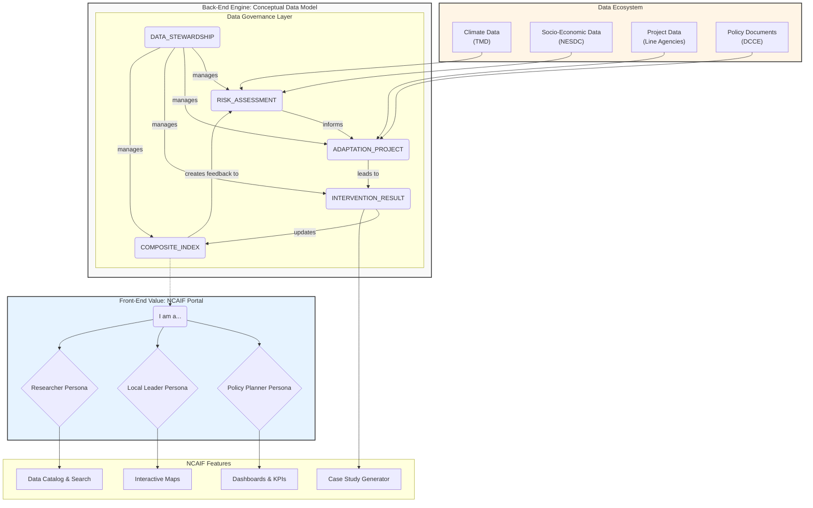

# NCAIF & CDM: System Architecture Blueprint

This document provides the architectural diagram illustrating the relationship between the **National Climate Adaptation Information Framework (NCAIF)** as the user-facing front-end and the **Conceptual Data Model (CDM)** as the back-end data engine. This blueprint visualizes the "Ideal Workflow" that enables a dynamic, feedback-driven system for managing and monitoring climate adaptation in Thailand.

## The "Engine Room" and the "Dashboard"

*   **Conceptual Data Model (CDM):** This is the **Engine Room**. It is not a single database but a logical blueprint for how different types of adaptation data are organized and relate to one another. It ensures that data is structured in a way that can answer critical questions about impact and effectiveness.
*   **National Climate Adaptation Information Framework (NCAIF):** This is the **Dashboard**. It is the user-friendly, persona-driven web portal that allows stakeholders to interact with the data structured by the CDM. It translates complex data relationships into actionable insights.

## Architectural Diagram

The following diagram illustrates how the CDM powers the NCAIF and creates a feedback loop for monitoring adaptation effectiveness.

### How the System Works: A Narrative

1.  **Data Ingestion:** Various **Data Sources** (Climate Models, Socio-Economic data, Project reports) feed into the system. This raw data populates the entities within the **Conceptual Data Model (CDM)**. For example, climate and socio-economic data are used to define the baseline `RISK_ASSESSMENT`.

2.  **The Core Logic (CDM):**
    *   A `RISK_ASSESSMENT` entity (e.g., "High flood risk in Province A") justifies the creation of an `ADAPTATION_PROJECT` (e.g., "Build flood wall in District B").
    *   The project's progress and outputs are captured in the `INTERVENTION_RESULT` entity (e.g., "Flood wall completed, protecting 500 households").
    *   Crucially, this result feeds into a `COMPOSITE_INDEX` (e.g., National Resilience Score).
    *   **The Feedback Loop:** The system is designed to use the data from the `COMPOSITE_INDEX` to update and refine the original `RISK_ASSESSMENT`, demonstrating the measurable impact of the adaptation investment.
    *   The entire process is managed by `DATA_STEWARDSHIP` rules, ensuring quality and accountability.

3.  **The User Experience (NCAIF):**
    *   A user arrives at the **NCAIF Portal** and selects their persona (e.g., a `Policy Planner`).
    *   The NCAIF, powered by the structured data from the CDM, presents a tailored view. The `Policy Planner` sees high-level `Dashboards & KPIs` showing risk levels and project progress. A `Local Leader` might see an `Interactive Map` of their specific area. A `Researcher` can use the `Data Catalog & Search` to find specific datasets.
    *   The `Case Study Generator` can automatically pull data from the `INTERVENTION_RESULT` entity to create success stories, supporting communications and reporting.

This architecture moves beyond a simple data repository. It creates a dynamic **National Adaptation Operating System** that connects data, actions, and outcomes, providing the foundation for a truly data-driven approach to climate resilience.
