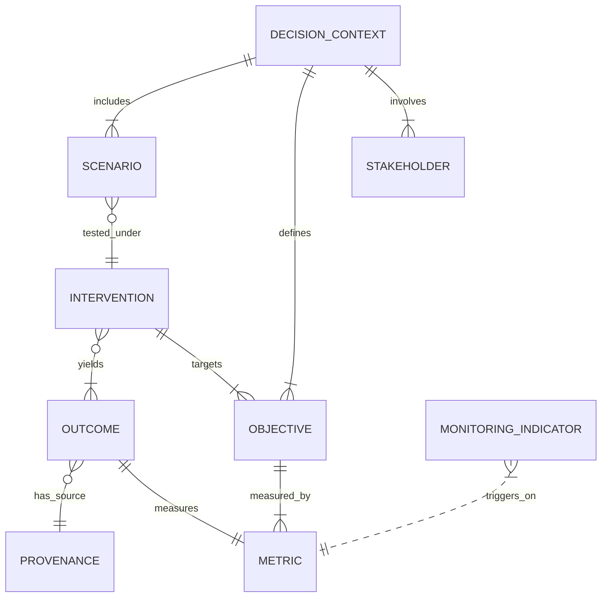
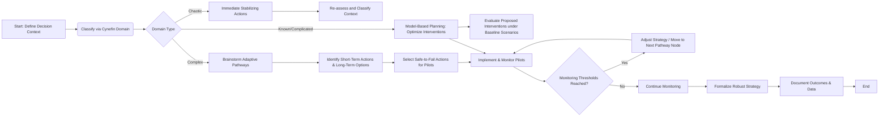
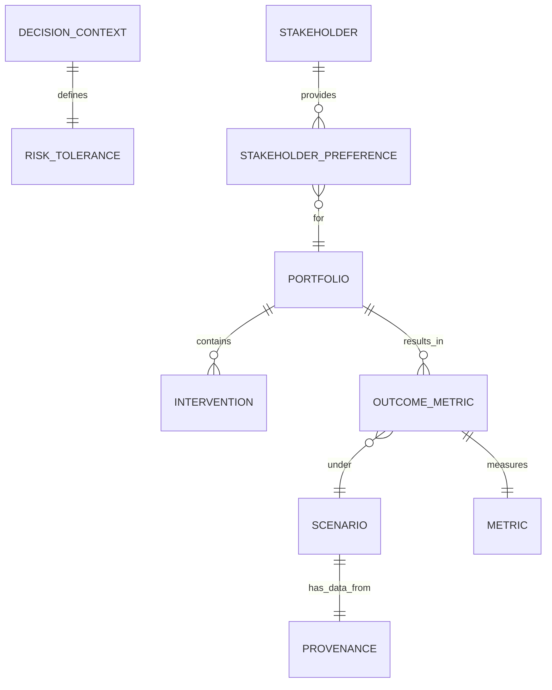
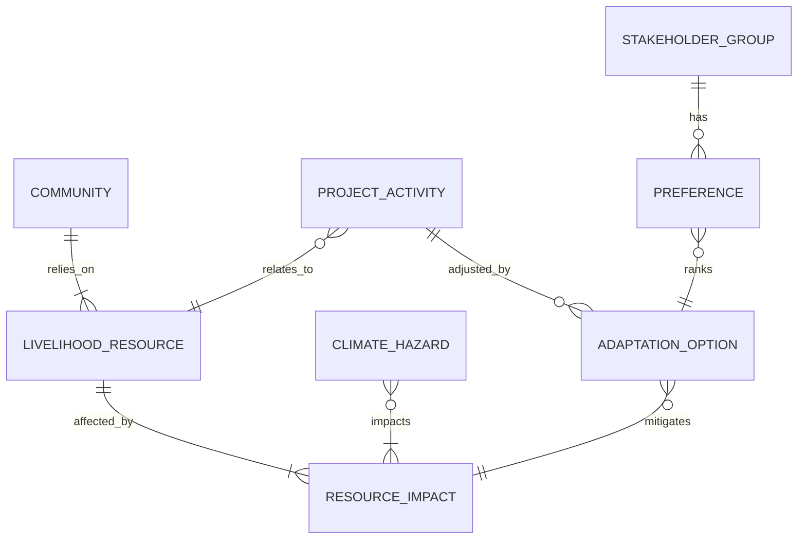

---
type:
  - deep_research
tags: []
source:
authors: []
year:
relevance_to: "[[]]"
key_findings: []
status: evergreen
sticker: emoji//1f916
---
https://chatgpt.com/share/e/6992f404-25e0-800c-a13e-8772f56c180b
# National Climate Adaptation Information System: Data Model and Decision-Support Frameworks

## Executive Summary  
This report surveys key adaptation planning frameworks and tools, identifies data-model attributes, and proposes workflows for a national climate adaptation information system. **Decision-making frameworks** reviewed include Snowden’s *Cynefin* framework (categorizing decision contexts by knowledge/uncertainty)【5†L886-L894】【40†L159-L168】, Robust Decision Making (RDM) for deep uncertainty【9†L99-L107】【40†L249-L258】, *Decision-Making Under Deep Uncertainty* methods (scenario planning, adaptive pathways, decision scaling)【40†L249-L258】【50†L335-L344】, and portfolio-based approaches (designing combinations of actions effective across futures)【20†L29-L37】【20†L53-L62】.  We also review tools tailored to adaptation portfolios: the Caribbean CCORAL platform (screening climate risk in development planning)【30†L38-L46】【30†L53-L60】 and the community-level CRiSTAL tool (identifying climate risks and livelihood targets)【32†L49-L58】【34†L134-L142】.  Related frameworks such as adaptation pathways (DAPP) emphasize flexible, sequenced strategies under uncertainty【37†L78-L87】【50†L335-L344】.  Each approach defines data needs (e.g. decision context, uncertainty types, temporal/spatial scales, stakeholders, objectives, metrics, scenarios, interventions, costs/benefits, monitoring indicators, governance and legal constraints, risk tolerances). We tabulate how major tools differ across these dimensions. 

Three exemplar **adaptation planning workflows** are developed: (1) *Cynefin-informed Adaptive Pathways*, in which actions are selected based on context classification (ordered vs. complex uncertainty) and executed as safe-to-fail probes with monitoring; (2) *RDM-driven Scenario Portfolio Optimization*, which uses iterative scenario simulation and multi-objective optimization to identify robust investment portfolios; and (3) *Community-Based Participatory Screening (CRiSTAL)*, where local stakeholders prioritize livelihood and climate hazards, screening and adjusting projects accordingly. For each workflow we specify data entities (e.g. DecisionContext, Intervention, Scenario, Stakeholder, Hazard, LivelihoodResource, OutcomeMetric), their relationships, metadata, and decision points. Entity-relationship (ER) and flowchart diagrams (in mermaid syntax) illustrate the data model structure and process flow for each approach.

We identify representative **case studies** for each workflow: for adaptive pathways, the City of Santa Cruz (CA, USA) embedded an adaptation pathways approach in coastal planning【48†L73-L79】 (complemented by Netherlands’ Dynamic Adaptive Policy Pathways experience【50†L335-L344】); for RDM, the Quilimarí River Basin (Chile) used an RDM process to evaluate water strategies under multiple climate scenarios【55†L303-L312】【55†L325-L332】; for community screening, villages in Dodoma, Tanzania applied CRiSTAL to assess drought impacts on livelihoods and co-design income-generation interventions【46†L29-L37】【46†L69-L75】. Each case illustrates data used (hydrological models, survey data, participatory mapping), outcomes (robust strategies, prioritized actions), and lessons (e.g. value of stakeholder engagement, limits of data). 

Based on these insights, we **recommend structuring the adaptation information system** around core entities: *DecisionContext* (including Cynefin domain, objectives, stakeholders, risk tolerance), *Scenario* (climate, socio-economic futures), *Intervention/Action* (adaptation options, costs, timing), *Portfolio* (bundles of interventions), *Metrics* (performance indicators, thresholds), *MonitoringIndicator*, *GovernanceUnit* (jurisdiction, legal framework), and *DataProvenance* (versioning of models and data sources). Relationships link these: e.g. a DecisionContext involves Scenarios, is evaluated by a set of Portfolios, each containing Interventions; Interventions produce Outcomes measured by Metrics; Stakeholders influence objectives and preferences. The model should encode *uncertainty* (through scenario probabilities or ranges) and *risk tolerance thresholds* (e.g. acceptable risk levels as attributes of DecisionContext)【28†L85-L94】【40†L249-L258】. Provenance/versioning fields should record data source and model versions for transparency. APIs should be provided to import climate projections, socio-economic data, and export analysis results. 

Finally, we note **gaps and research needs**. Few systems explicitly capture *risk tolerance* (tolerance levels are usually implicit【28†L85-L94】), so methods to encode stakeholder risk preferences are needed. Integrating qualitative context (Cynefin domains, stakeholder worldviews) with quantitative models is still an open challenge. Pilot datasets that combine climate projections, infrastructure and socio-economic layers (e.g., downscaled RCP scenarios linked with census and land-use data) would help validate scenario-based workflows. Similarly, compiling sample adaptation portfolios (with cost and effectiveness metrics) could test optimization modules. We suggest starting with publicly available pilot data: e.g. local climate model outputs (CORDEX), open socio-economic indicators (World Bank, UNDP), hazard maps (flood/drought zones), and reported adaptation measures (NAPs/NDCs). These can be used to test the data model and decision workflows, identifying where further tool development or data collection is needed.

## 1. Decision-Making Frameworks and Tools

### Cynefin Framework  
The **Cynefin framework** (Snowden & Boone) categorizes decision contexts into *clear (simple), complicated, complex,* and *chaotic* domains based on the knowability of causes and effects【5†L886-L894】. In adaptation planning, Cynefin helps determine methods: *clear* problems (well-understood cause-effect) use best practices; *complicated* problems require analysis and expertise; *complex* problems (interacting uncertain factors) call for emergent, iterative exploration (e.g. pilots, adaptive experiments); and *chaotic* problems need immediate action to regain stability【5†L886-L894】. Each context implies different data needs: e.g. complex domains emphasize hypothesis generation, multiple plausible models, and sense-making dialogues, while complicated domains rely on analytical models and experts. Cynefin thus provides a high-level *decision context* attribute in a data model (e.g. domain type, knowledge level) and suggests workflows: complex contexts trigger adaptive pathways and learning loops, whereas known contexts may proceed with traditional risk assessment【5†L886-L894】【40†L249-L258】. Incorporating Cynefin means including entities like *DecisionContext* (with domain label and uncertainty type) and tracking *SenseMaking* events as metadata.

### Robust Decision Making (RDM) and DMDU Methods  
**Robust Decision Making (RDM)** is an analytic framework for deeply uncertain problems【9†L99-L107】【40†L249-L258】. Instead of optimizing for a single forecast, RDM tests candidate strategies across many plausible futures (scenarios) to identify *robust* options that meet objectives under wide uncertainty【9†L99-L107】【40†L249-L258】. RDM uses a cycle of (1) framing objectives/metrics (e.g. water supply reliability), (2) simulating strategies over ensembles of uncertainties (via models), (3) vulnerability analysis to find futures where strategies fail, and (4) revising strategies and repeating【52†L138-L147】【52†L157-L166】. The iterative process continues until strategies performing acceptably across the range of futures are found. Key concepts include *portfolio strategies*, stress-testing, and stakeholder-driven trade-off analysis【52†L146-L155】【52†L162-L170】. 

RDM falls under **Decision Making under Deep Uncertainty (DMDU)**, which also encompasses scenario planning, adaptive pathways, and decision scaling【40†L249-L258】【52†L198-L207】. Scenario planning is widely used to *envision* futures: it involves identifying a decision challenge, key uncertainties, constructing plausible narratives, and using them to test options【40†L204-L213】. **Adaptive Pathways** (including Dynamic Adaptive Policy Pathways, DAPP) is a DMDU technique that maps sequences of actions triggered by monitoring thresholds【38†L122-L130】【50†L335-L344】. It asks questions like: “At what points should different actions be taken as conditions change?” This yields a network of decision paths under uncertainty【38†L122-L130】【50†L335-L344】. 

RDM and related DMDU methods imply data attributes for *Scenarios* (sets of uncertain variables and climate projections), *Strategy* or *Plan* (sets of interventions or policy levers), *Metrics* (performance indicators), and *Trade-offs*. The process model is inherently iterative: data must record successive *ModelRuns* under varied *Assumptions*, with vulnerability triggers. In the data model, entities like **Portfolio** (candidate action bundles), **FutureProjection** (scenario variants), and **ThresholdTrigger** (monitoring metrics) would be needed. RDM often employs an **XLRM matrix** structure: Measures (indicators), Levers (policy choices), Uncertainties, and Models【52†L162-L170】, each of which should map to data attributes (e.g. measures and levers as entities, uncertainties as scenario parameters). 

### Portfolio Analysis and Multi-Criteria Approaches  
A **portfolio approach** to adaptation (analogous to financial portfolios) selects a combination of measures whose combined performance is robust across futures【20†L29-L37】【20†L53-L62】. Portfolio Analysis (PA) helps identify *efficient portfolios* that maximize expected benefit for a given risk or minimize risk for a given benefit【20†L35-L43】. In climate adaptation, portfolios might include mixed strategies (e.g. infrastructure + nature-based + community programs) to hedge against uncertainty【20†L29-L37】【20†L43-L52】. The strengths of PA include structured uncertainty management and quantification of effectiveness【20†L53-L62】, while weaknesses are heavy data needs and complexity【20†L69-L77】. 

Multi-criteria decision analysis (MCDA) is often used in adaptation planning to handle trade-offs and multiple objectives (e.g. cost, equity, ecosystem health). MCDA frameworks (like AHP, PROMETHEE, etc.) can rank portfolios by scoring and weighting criteria. These approaches require defining **Objectives** and **Criteria/Metrics** and capturing stakeholder preferences. In a data model, this suggests entities like **Objective** (goal being optimized), **Criterion**, and *Weight* or *PreferenceProfile*. Portfolio optimization parameters (e.g. risk-return tradeoff) may also be stored per context.

Other relevant tools include **Info-Gap decision theory** (choosing actions that maximize robustness to the worst-case) and **Real Options/Adaptive Management** (valuing flexibility). While not explicitly required, the data model should accommodate representing options, contingencies, and adaptive rules. For example, *AdaptiveRule* entities could encode trigger-based action switches.

### Risk Tolerance in Adaptation  
**Risk tolerance** (the level of residual risk stakeholders are willing to accept) is a critical but often implicit concept in adaptation【28†L85-L94】. Adaptation plans inherently assume some risk tolerance: planned actions manage only part of the hazard, leaving *residual risk*. Brown (2025) argues that lack of explicit risk tolerance can misalign expectations, and calls for openly declaring acceptable risk thresholds【28†L81-L89】【28†L90-L99】. In practice, risk tolerance might be encoded as thresholds on loss/probability (e.g. “keep flood risk below X% annual chance”) or as stakeholder survey values. 

For a data model, *RiskTolerance* could be an attribute of **DecisionContext** or **StakeholderProfile**, specifying e.g. maximum acceptable probability of failure or loss. Capturing risk appetite requires fields for threshold values and normative descriptions (e.g. *low*, *medium*, *high tolerance*). Including risk tolerance explicitly ties planning to stakeholders’ social/ethical values, which can influence portfolio optimization and scenario selection. For instance, a portfolio that risks large losses under one scenario might be rejected if risk tolerance is low. These values should be recorded and versioned like other metadata.

### CCORAL (Caribbean Climate Online Risk and Adaptation Tool)  
The **CCORAL** tool is a Caribbean-specific, web-based platform for climate-resilient decision-making【30†L38-L46】【30†L53-L60】. It guides users through screening their activities for climate risks and applying tailored climate risk management steps. CCORAL components include a *screening exercise* (initial quick check), *understanding climate influence* (mapping decisions through a climate lens), *end-to-end risk management processes*, and a *toolbox* of relevant methods【30†L38-L46】. It encourages users to prioritize efforts to fit their context, time, and uncertainties【30†L53-L60】. 

In data-model terms, CCORAL implies capturing *Project* or *Activity* entities (with planned timelines, budgets, stakeholders), tagging them with *ClimateHazards* and vulnerability indicators. It also suggests a *ToolRecommendation* entity linking contexts to suggested methods. CCORAL’s screening yields structured outputs (reports of climate risks, priority areas). These could map to **DecisionContext** attributes: sector (infrastructure, policy, program), scale (legislation, planning, project), and vulnerability scores. The data model should accommodate linking CCORAL-generated *Questions* and *Answers* (e.g. “Was climate considered in project design?”) as part of a decision metadata record. While CCORAL itself is region-specific, its structure illustrates general features: focus on climate lens, pragmatic context-fitting, and documentation of screening results. 

### CRiSTAL (Community-Based Risk Screening Tool)  
**CRiSTAL** (Community-Based Risk Screening Tool – Adaptation and Livelihoods) is a participatory project-planning tool to integrate climate adaptation at the community level【32†L49-L58】【34†L134-L142】. It helps local project planners identify which livelihood resources (e.g. crops, water, forests) are most affected by climate hazards and design adaptation actions accordingly【32†L49-L58】【34†L134-L142】. CRiSTAL’s outputs include lists of key livelihood resources affected by climate, proposed adjustments to current projects, prioritized new activities, and monitoring indicators. 

Key attributes from CRiSTAL for a data model are **LivelihoodResource**, **Hazard**, **Impact**, **AdaptationOption**, and **CommunityStakeholder**. Relationships include: a *Hazard* impacts certain *Resources* in a community; existing *ProjectActivity* affects resources; *AdaptationOption* addresses one or more hazards and supports resources; stakeholders (e.g. women, farmers) are linked to resources. CRiSTAL emphasizes *participatory inputs*, so data entries often come from local workshops. Thus, metadata on who (which stakeholder group) contributed each piece of data (e.g. relevance of a resource) is important. Finally, CRiSTAL supports *monitoring and evaluation*, implying a connection to **MonitoringIndicator** entities for tracking project outcomes over time. 

## 2. Key Attributes and Framework Comparison

In designing a data model for adaptation planning, we identify critical attributes to represent based on the above frameworks. These include:

- **Decision Context**: Type of problem (clear/complicated/complex/chaotic)【5†L886-L894】, geographic/sectoral context, planning scale (national, regional, local).
- **Uncertainty Types**: Presence of stochastic (quantified) vs. deep uncertainties (unknown futures)【5†L886-L894】【28†L85-L94】, scenario variability, model uncertainty.
- **Temporal Scales**: Short-term actions, long-term strategies, decision horizons, time steps of climate scenarios.
- **Spatial Scales**: Local (community), regional, national levels; cross-scale interactions.
- **Stakeholders/Actors**: Groups involved (government agencies, communities, businesses), their roles and risk tolerances【28†L85-L94】.
- **Objectives/Criteria**: Adaptation goals (e.g. safety, cost-effectiveness, equity), multi-dimensional criteria.
- **Metrics/Indicators**: Measures of success (e.g. avoided losses, vulnerability indices, benefit-cost ratios).
- **Scenarios**: Climate projections (RCPs/SSPs), socio-economic futures, "decision-relevant scenarios" (as in RDM)【40†L204-L213】【52†L162-L170】.
- **Interventions/Options**: Adaptation actions (infrastructure projects, policies, nature-based measures), with attributes (cost, benefits, duration, flexiblity).
- **Costs & Benefits**: Economic (investment, maintenance, avoided damage), social and ecological co-benefits or trade-offs.
- **Monitoring Indicators**: Triggers and progress metrics (e.g. sea level threshold reached, crop yield).
- **Governance & Legal Constraints**: Jurisdictional mandates, regulations, funding rules that limit options.
- **Risk Tolerance Thresholds**: Acceptable risk levels (e.g. flood return periods, income variability tolerances)【28†L85-L94】.
- **Portfolio Optimization Params**: Risk-return preferences, diversification rules, feasible sets.
- **Data Provenance/Versioning**: Source and version of datasets (climate data, models, study reports), time-stamped updates.

The table below compares how selected frameworks/tools handle these attributes:

| Attribute               | **Cynefin**              | **RDM (DMDU)**                                            | **Portfolio Analysis**                                  | **Adaptation Pathways (DAPP)**                           | **CCORAL**                                                | **CRiSTAL**                                              |
|-------------------------|--------------------------|-----------------------------------------------------------|---------------------------------------------------------|----------------------------------------------------------|-----------------------------------------------------------|----------------------------------------------------------|
| Decision context        | Domain (clear/complicated/complex/chaotic)【5†L886-L894】 | Defined scope via decision framing (objectives, XLRM)【52†L162-L170】 | Focuses on multi-option context (no single solution)【20†L29-L37】 | Sequenced decisions over time as conditions change【38†L122-L130】 | Project/activity context (legislation, plan, project)【30†L38-L46】 | Project context at community level【32†L49-L58】          |
| Uncertainty types       | Characterizes knowledge (known vs unknown)【5†L886-L894】      | Deep uncertainty modeled via scenarios; stress-test uncertainty factors【52†L162-L170】 | Accounts for climate and impact uncertainty via ensembles【20†L53-L62】 | Considers timing uncertainty (when thresholds are reached)【38†L122-L130】 | Considers climate variability and change in planning       | Considers current variability; encourages checking multiple projections【33†L107-L115】 |
| Temporal scales         | Not explicit (context agnostic)         | Short-term decisions vs. long-term goals (iterative)            | Multi-decadal horizon; compares portfolios over time horizon | Long-term planning with trigger-based shifts (e.g. to 2100)【50†L335-L344】 | Screening through project/planning cycle (short to medium term) | Project life-cycle (e.g. 2–5 days assessment; up to 5–20 yrs project)【33†L38-L47】【32†L49-L58】 |
| Spatial scales          | Contextual (any scale)                  | Can be applied at watershed, city, national scales (case-specific) | Often regional/national portfolios of projects              | Typically local to regional (e.g., river basins, cities)【38†L122-L130】     | National/regional Caribbean focus (users pick country)       | Local/community scale【32†L49-L58】【33†L42-L50】         |
| Stakeholders            | Involves sense-makers vs experts       | Extensive stakeholder engagement in framing and trade-offs【9†L99-L107】【55†L312-L322】 | Decision makers define risk-return preferences           | Stakeholders define thresholds and values along pathways【50†L335-L344】 | Targets government/planners, communities, etc【30†L67-L75】 | Project planners, managers, local experts【32†L49-L58】【33†L42-L50】 |
| Objectives              | Broad (depends on domain)             | Explicitly specified (often multi-objective, per XLRM)         | Maximizing benefit vs. minimizing risk (economic or physical)【20†L35-L43】 | Implicit goals (minimize vulnerability, cost over time)      | Climate-resilience mainstreaming goals (sector-specific)    | Integrate livelihood security with climate adaptation【32†L49-L58】 |
| Metrics/Indicators      | Not prescribed                    | Defined by stakeholders (performance measures in XLRM)       | Portfolio return, risk metrics, cost-effectiveness【20†L35-L43】 | Performance thresholds (e.g. flood levels) trigger actions   | Screening questions; no fixed metrics (checklist format)    | Lists of livelihood/climate indicators for monitoring【34†L122-L130】 |
| Scenarios              | Qualitative context scenarios       | Uses many quantitative futures (climate, socio-economic)【52†L162-L170】  | Portfolios evaluated under set of scenarios (RCPs etc)    | Scenario-building for possible transitions/pathways        | Uses country/regional climate projections (in guidance)    | Considers community’s observed and future climate perceptions【46†L39-L45】 |
| Interventions/Options   | Determined by domain (standard vs safe-to-fail) | Strategies (decision levers) defined in decision framing【52†L162-L170】  | Selection of complementary actions (infrastructure, NRCS, etc) | Mix of near-term and long-term actions (flexible plans)      | Project activities, policies, budget lines (context-specific) | Project activities at village level (e.g. crop, honey)【46†L41-L49】   |
| Costs/Benefits          | Not explicit in framework             | Costs and benefits evaluated as performance metrics           | Central: expected return vs risk (economic analysis)     | Considered qualitatively or via cost thresholds            | Not explicitly quantified; qualitative justification      | Economic/in-kind costs via local plans, but mainly qualitative |
| Monitoring indicators   | Not defined by framework             | Builds explicit *Signpost* indicators (decision triggers)      | Monitors portfolio performance, risk metrics over time     | Emphasizes monitoring for trigger conditions【50†L335-L344】    | Encourages data collection as part of screening output      | Defines factors to be monitored (e.g. market linkages)【46†L45-L53】  |
| Governance              | Implied by context (e.g. complex often multi-agency) | Embedded via stakeholder process (policy context)     | Requires policy/institutional support for portfolios        | Requires institutional frameworks to adapt plans           | Linked to national planning, investment, legislation【30†L67-L75】 | Linked to local governance structures and community orgs   |
| Legal constraints       | Externally accounted (if clear/complicated domain) | Can include in decision framing as fixed parameters        | Not inherent in model (but real cases include regulations)  | Plan dependent on legal mandates to revise infrastructure  | Reflects statutory requirements in project planning        | Considers local customary rules in communities            |
| Risk tolerance thresholds | Not explicitly addressed (implied by domain) | Represented via performance thresholds (e.g. acceptable failure rate) | User-defined (efficient frontier selection)               | Implicit (pathway determined by acceptable risk levels)     | Encourages setting targets/goals (e.g. resilience level)    | Implicit in stakeholder prioritization (no formal number)    |
| Portfolio optimization parameters | N/A (does not optimize)         | Uses trade-off analysis (Pareto, regret minimization)         | Central: risk-return trade-off, diversification rules      | Does not optimize, but sequences actions to maintain options | Supports choosing among tools (not numerical optimization) | Focus on specific project-level changes, not portfolio mixing |
| Data provenance/versioning | Requires capturing context evolution  | Iterative runs tracked (tool like EMA stores provenance)       | Data-intensive; underlying data versions critical         | Requires tracking plan updates and trigger dates           | Web tool versions (last updated 2014)【30†L159-L168】         | Versioning of project plans not formalized (uses outputs)    |

*Table: Comparison of decision-support frameworks and tools across key attributes. Sources: Cynefin (Snowden)【5†L886-L894】; RDM/DMDU (Lempert et al., RAND)【9†L99-L107】【40†L249-L258】; Portfolio Analysis (Hunt & Watkiss, MEDIATION)【20†L29-L37】【20†L53-L62】; Adaptation Pathways (Haasnoot et al.)【37†L78-L87】【50†L335-L344】; CCORAL (CCCC)【30†L38-L46】【30†L53-L60】; CRiSTAL (IISD)【32†L49-L58】【34†L134-L142】.*  

## 3. Adaptation Planning Workflows

We outline three exemplar workflows, each reflecting a different decision-support approach. For each, we list stepwise actions, needed data entities and relationships, and provide mermaid diagrams for the conceptual data model (entity-relationship) and process flow.

### Workflow 1: Cynefin-Informed Adaptive Pathways  
In this workflow, planners first **classify** the decision context using the Cynefin framework, then use an adaptive-pathways approach tailored to that context.  

**Steps:**  
1. **Context Classification:** Gather initial information to determine the Cynefin domain (clear, complicated, complex, chaotic). This uses expert judgement and available data on system behavior and uncertainties【5†L886-L894】.  
2. **Define Objectives & Metrics:** Collaborate with stakeholders to set goals (e.g. “reduce flood damage by X% by 2050”), metrics, and decision criteria. Include stakeholder risk tolerance and values.  
3. **Select Methods Based on Domain:**  
   - *Clear/Complicated:* If the context is well-understood, proceed with conventional planning: build predictive models and select technically optimal solutions.  
   - *Complex:* If cause-effect is unclear, develop multiple hypotheses (models) and treat interventions as experiments. Identify *adaptation pathways* by brainstorming sequences of actions that could address potential futures【50†L335-L344】.  
   - *Chaotic:* If immediate crisis, take immediate corrective action to stabilize, then re-classify context as complex or complicated for planning.  
4. **Propose Pathways/Actions:** For complex domains, create an initial *Adaptive Pathway* diagram: list possible short-term actions and alternative future actions at trigger points【50†L335-L344】.  
5. **Test Safe-to-Fail Actions:** Implement pilot projects or “safe-to-fail probes” for highest-priority actions (especially in complex contexts). Collect performance data.  
6. **Monitor and Update:** Establish monitoring indicators (thresholds from Step 2). If monitoring triggers signal path changes or failures, return to step 3 to adjust strategy (i.e. move along adaptive pathway).  

**Data Entities & Relationships:**  
- **DecisionContext** (attributes: contextID, domainType, spatialScale, temporalScope).  
- **Stakeholder** (role, riskTolerance). Connected to DecisionContext (many-to-many: stakeholders involved in context).  
- **Objective** (goal, description) and **Metric** (indicatorID, unit). Objectives relate to DecisionContext; Metrics map to Objectives.  
- **Intervention** (actionID, type, cost, expectedEffectiveness). Interventions link to Objectives (which they target) and to Scenarios.  
- **Scenario** (scenarioID, description, uncertainties[]). Each DecisionContext has one or more Scenarios.  
- **Outcome** (metric values resulting from an Intervention under a Scenario). These link Intervention–Scenario pairs to Metric values.  
- **MonitoringIndicator** (thresholdID, measuredMetric, thresholdValue). Tied to Objectives or DecisionContext.  
- **DataProvenance** (sourceID, version, timestamp) linked to data entries (Intervention assumptions, Scenario data, etc).  
Relationships: DecisionContext–Stakeholder (participation), DecisionContext–Objective (goals under that context), Intervention–Objective (addresses), Intervention–Scenario (simulated under), Outcome[Intervention–Scenario]–Metric (performance), MonitoringIndicator–Intervention/Metric (for triggers).  





This workflow embeds the Cynefin classification as a *DecisionContext* attribute and uses it to choose the planning method. It illustrates the need for data on interventions, scenarios, and monitoring. Citations: Cynefin framework【5†L886-L894】; adaptive pathways and DAPP emphasis on sequential actions and monitoring【50†L335-L344】.

### Workflow 2: RDM-Driven Scenario-Robust Portfolio Optimization  
This workflow uses **Robust Decision Making** with scenario analysis and portfolio optimization to select a mix of adaptation options.

**Steps:**  
1. **Framing:** Engage stakeholders to define decision objectives, constraints, and performance metrics (financial, social, environmental)【52†L162-L170】. Construct an XLRM table listing Measures (M: metrics), Levers (L: possible interventions), key eXogenous uncertainties (X: future variables), and Models (R: system models)【52†L162-L170】.  
2. **Generate Candidate Portfolios:** Compile a set of possible portfolios of interventions (each portfolio is a combination of adaptation actions and timing). Each portfolio has estimated *costs* and *benefits*.  
3. **Scenario Generation:** Develop an ensemble of plausible futures (Scenarios) by sampling uncertainties (e.g. climate, demand, socio-economic change)【52†L162-L170】. Each scenario is a set of values for X factors, possibly based on climate projections (RCPs) and socio-economic storylines.  
4. **Simulation:** For each portfolio under each scenario, run models (e.g. hydrological or economic models) to produce outcomes (water supply reliability, economic loss, etc.). Record outcome **Metrics**.  
5. **Vulnerability Analysis:** Identify conditions (scenarios) where each portfolio fails to meet thresholds. This is akin to stress-testing strategies【40†L249-L258】. Tag these as *failure scenarios*.  
6. **Robustness and Trade-Offs:** Use quantitative criteria (e.g. satisficing, minimax regret, or multi-objective trade-offs) to score portfolios by robustness (performance consistency across scenarios)【52†L146-L155】. E.g., compute portfolio return (benefits) vs. risk (variance or shortfall).  
7. **Stakeholder Deliberation:** Present a *Pareto frontier* or trade-off curves to decision-makers (e.g. via interactive charts). Choose one or more robust portfolios based on risk tolerance【52†L146-L155】.  
8. **Refine (Iterate):** If no portfolio meets criteria, generate additional portfolios or refine scenarios and repeat.  
9. **Implementation & Monitoring:** Adopt the chosen portfolio, implement in phases. Set up monitoring of key indicators. As real-world data arrives, update models and possibly re-run the analysis (iterative planning).  

**Data Entities & Relationships:**  
- **Scenario** (scenarioID, parameters, probability weight).  
- **Portfolio** (portfolioID, set of Interventions, totalCost).  
- **Intervention** (same as above, cost, capacity). Portfolios link to multiple Interventions.  
- **OutcomeMetric** (portfolioID, scenarioID, metricID, value). Records simulation results.  
- **RiskTolerance** (contextID, threshold values) tied to DecisionContext.  
- **StakeholderPreference** (portfolioID, score, comment) for participatory inputs.  
- **Provenance** (records simulation model versions, data sources).  
Relationships: Portfolio–Intervention (contains), Portfolio–OutcomeMetric (performance), Scenario–OutcomeMetric (under this future).  
Mermaid ER and flow:



```mermaid
flowchart LR
    A[Define Objectives & Scope (XLRM)] --> B(Create Candidate Portfolios)
    B --> C(Generate Scenario Ensemble)
    C --> D{For Each Portfolio × Scenario}
    D --> E[Run Simulations → Compute Metrics]
    E --> D
    D --> F[Vulnerability Analysis: Identify Failures]
    F --> G[Compute Robustness Scores (e.g. Pareto)]
    G --> H[Visualize Trade-offs to Stakeholders]
    H --> I{Select Portfolio(s) based on preferences}
    I --> J[Adopt Portfolio]
    J --> K[Implement & Monitor Portfolio]
    K --> L{New Data Available?}
    L -- Yes --> M[Update Models/Scenarios] 
    M --> N[Re-run Analysis]
    L -- No --> O[Maintain & Monitor]
    N --> D
    O --> Z[End]
```

This workflow aligns with RDM principles【52†L162-L170】【40†L249-L258】: iteratively stress-test strategies (portfolios) across futures and use stakeholder input (risk tolerance) to choose robust options. It treats adaptation as an optimization under uncertainty, requiring rich data on intervention costs/benefits and plausible scenarios.  

### Workflow 3: Community-Based Participatory Screening (CRiSTAL Approach)  
This workflow mirrors the CRiSTAL methodology for community projects. It emphasizes local participation and livelihood-focused analysis.

**Steps:**  
1. **Community Scoping:** Collect baseline data on community livelihoods, natural resources, and socio-economic context (through surveys, focus groups).  
2. **Hazard Identification:** With community input, list relevant climate hazards (droughts, floods, storms, etc.) observed and anticipated.  
3. **Resource-Risk Mapping:** Identify key *LivelihoodResources* (water, crops, livestock, forest goods, etc.) and assess how each hazard impacts them (damage levels, frequency)【46†L39-L45】.  
4. **Autonomous Adaptation:** Document existing coping strategies (migration, savings, crop changes). Note gaps where climate change may outpace traditional coping.  
5. **Project Review:** For an ongoing or planned development project, screen each activity to see how it affects or is affected by climate risks (e.g. a water project may increase vulnerability if it relies on rainfall).  
6. **Adaptation Strategy Design:** Based on the above, co-develop adjustments to the project and propose new activities. For each proposed action, estimate rough cost (if possible) and feasibility. Example from case study: consider beekeeping or new crops as alternatives【46†L41-L49】.  
7. **Prioritization:** Rank adaptation actions by combining factors like urgency, benefit, and community preference. (Note: original CRiSTAL does not prescribe a formal algorithm but notes resources to address first.)  
8. **Monitoring & Learning:** Define simple indicators for each action’s success (e.g. crop yields, income levels)【32†L49-L58】. Plan follow-up reviews.  

**Data Entities & Relationships:**  
- **Community** (communityID, location, demographics).  
- **LivelihoodResource** (resourceID, type) (e.g. maize, pasture, water well). Communities have many Resources.  
- **ClimateHazard** (hazardID, type, frequency). Hazards impact Resources.  
- **ResourceImpact** (links Resource–Hazard, with impactScore).  
- **ProjectActivity** (activityID, sector, description).  
- **AdaptationOption** (optionID, derivedFromActivity, description, costEstimate). Options target specific Resource-Hazard issues.  
- **Preference** (communityGroupID, ImportanceScore for resource or option).  
Relationships: Community–LivelihoodResource (depends_on), LivelihoodResource–ClimateHazard (affected_by via ResourceImpact), ProjectActivity–LivelihoodResource (influences), AdaptationOption–ResourceImpact (addresses), StakeholderGroup–Preference (for resource/option).  




This participatory workflow produces data linking hazards, livelihoods, and options. As a result, the data model must capture community-specific context: for example, **LivelihoodResource** with attributes (e.g. crop area, income share), and **ResourceImpact** (current damage and vulnerability). The Tanzanian case study showed CRiSTAL yielding lists of impacts and suggestions: “list of livelihood resources most affected by climate hazards” and “proposed new activities”【33†L137-L139】【46†L29-L37】. Such lists would populate the data model tables for Impact and Option. Notably, CRiSTAL’s outputs are mostly qualitative; one recommendation was to add quantitative criteria (“C&I guidelines”)【46†L69-L75】. Data provenance here includes workshop dates and participant groups, which should be recorded.

## 4. Case Studies and Use Cases

**Adaptive Pathways – Santa Cruz, California (USA):** The City of Santa Cruz applied an *adaptation pathways* approach for coastal flood resilience【48†L73-L79】. Planners embedded a flexible timeline of actions into local plans, recognizing uncertainty in sea-level rise. They integrated community engagement and regional coordination, yielding a long-term strategy that sequences interventions (e.g. policy changes, infrastructure upgrades) triggered by monitoring thresholds【48†L73-L79】. Key data used included projected sea-level rise scenarios, asset vulnerability assessments, and community vulnerability indicators. Outcomes included an explicit commitment to revisit plans as climate science evolves. Lesson: embedding pathways in policy aligns funding and builds stakeholder buy-in under uncertainty【48†L73-L79】. 

**RDM/Scenario Planning – Quilimarí River Basin, Chile:** Researchers used RDM with stakeholders to plan water management in an arid coastal basin【55†L303-L312】【55†L325-L332】. Groundwater supply was threatened by climate change and overuse. The team defined conflicting objectives (agriculture vs. potable supply) and ran a WEAP-MODFLOW model across many futures (up to 40% precipitation decline scenarios)【55†L303-L312】. They identified desalination as a robust option under most futures. This work engaged local decision-makers, revealing critical uncertainties (salinity intrusion rates) and testing options via simulation. It demonstrated that “water management strategies under uncertainty benefit from local engagement to test robust decisions”【55†L325-L332】. Data included hydrological data, infrastructure costs, and social parameters. Outcome: a prioritized plan that was robust to extreme dry futures. 

**Community Screening – Dodoma Region, Tanzania (CRiSTAL):** In 2005, three villages in Dodoma used CRiSTAL to address severe drought impacts on rural livelihoods【46†L29-L37】. Community members identified drought and crop failure as key hazards and mapped effects on resources (e.g. maize, honey production)【46†L29-L37】. Using CRiSTAL, they explored alternative income-generating activities (handicrafts, drought-resistant crops) that were affordable for poor households【46†L25-L32】【46†L41-L49】. The tool helped “analyse how changes in the climate system could affect livelihoods”【46†L29-L37】, making climate concepts concrete at the village level. The process was time-consuming and highlighted the need for further guidance on indicators【46†L69-L75】. The result was a community-led adaptation plan with adjusted agricultural and market strategies. Lesson: participatory screening can uncover local priorities and feasible solutions, but requires capacity-building and follow-up to become quantitative.

These cases illustrate each workflow in practice: the Santa Cruz case embodies adaptive pathways with policy alignment【48†L73-L79】, Quilimarí exemplifies RDM-driven portfolio screening in water management【55†L303-L312】【55†L325-L332】, and Dodoma shows community-based screening adapting CRiSTAL【46†L29-L37】【46†L69-L75】. They used diverse data (climate models, surveys, GIS) and yielded lessons on stakeholder engagement, the need for flexible planning, and tool improvements.

## 5. Recommendations for the Data Model

Based on the above, a **core data model** for a national adaptation system should include the following entities and features:

- **DecisionContext**: Encapsulates a planning effort (e.g. “National flood plan, 2025–2035”). Attributes: domainType (Cynefin), description, temporal scope. Linked to Stakeholders, Objectives, RiskTolerance.  
- **Stakeholder/Actor**: Entities representing ministries, community groups, NGOs, each with roles and risk tolerance preferences【28†L85-L94】.  
- **Objective**: High-level goals (e.g. “Ensure water security”), with related **Metric** indicators (quantitative targets, e.g. “<X flood events/year”). Metrics can include uncertainty bounds.  
- **Scenario**: Each scenario is an instance of future conditions, defined by variables (climate projections, socio-economic factors). It has attributes for scenario name, source, and temporal extent. Stored climate/time series (projections) may be linked via standard APIs (e.g. Climate Data API).  
- **Intervention/Action**: Adaptation measures (projects, policies, NBS). Attributes: type, cost, expected life, flexibility (e.g. reversible). Linked to Objectives (which objectives it serves) and to *Portfolio*.  
- **Portfolio**: A collection of Interventions considered together. Includes attributes for total cost, combined benefit, and optimization parameters (e.g. weightings).  
- **OutcomeMetric**: Results of combining an Intervention (or Portfolio) with a Scenario, producing values for Metrics. Stored with provenance (model used, data version)【52†L162-L170】.  
- **MonitoringIndicator**: Threshold triggers or indicators for adaptive management. Attributes: type, target value. Used to link Outcomes to Decision points.  
- **GovernanceUnit**: Institutional context (jurisdiction, department). Captures where legal constraints apply.  
- **LegalConstraint**: e.g. regulations, budget limits. Tied to GovernanceUnit or DecisionContext.  
- **RiskToleranceProfile**: Explicit risk levels or thresholds (e.g. maximum acceptable risk of failure) for a DecisionContext, derived from stakeholder input【28†L85-L94】.  
- **Provenance/Versioning**: A metadata entity recording dataset/model versions (e.g. version of climate data, time/date of analysis). Every data value (climate input, cost estimate, output) should link to a provenance record. This enables auditability and updates.

Relationships to encode: *DecisionContext* “involves” many *Stakeholders*, *Objectives*, and *Constraints*. *Scenario* “applies to” a DecisionContext (with probability). *Intervention* belongs to zero or more *Portfolios*; a Portfolio covers many Interventions. *Intervention* and *Scenario* jointly map to *OutcomeMetric*. *Stakeholder* has preferences over Portfolios or Options. *MonitoringIndicator* is associated with an Intervention or Metric for triggers.

**Versioning and Provenance:** All core entities should have timestamp and source fields. For example, each **OutcomeMetric** entry must note the model used and its version (e.g. a WEAP model v2.1) as provenance. Using established metadata standards (e.g. ISO 19115 or W3C PROV) can ensure interoperability. The system should also support **data versioning**: e.g. “climateData_v2026-01” used in Scenario; this can be an attribute of Scenario. APIs for interoperability: 
- **Climate APIs** (e.g. CMIP/FAIR data portals) to ingest projections into Scenario.
- **Economic/Asset APIs** (e.g. World Bank, OpenStreetMap) for intervention costs and infrastructure data.
- **Tools interoperability**: the model should be able to exchange data with decision-support tools (RDM platforms, CRiSTAL outputs) via REST/GraphQL APIs or common data formats (JSON, GeoJSON).

**Uncertainty Representation:** The model needs fields for uncertainty. For numeric data (costs, yields), store ranges or probability distributions. For scenario parameters, store multiple realizations. Uncertainty can be encoded via separate *Uncertainty* entity linking to Scenarios or Parameters, with type (stochastic vs. deep) and amplitude. 

**Risk Tolerance Encoding:** As noted, include explicit fields for risk tolerance (e.g. acceptable exceedance probability) in DecisionContext or StakeholderPreference. These can guide which portfolios are considered. For example, a boolean “riskAcceptance: true/false” for each metric indicating if the stakeholder accepts breach of a threshold.

In summary, the data model should be ontology-like, capturing *entities* for contexts, actions, data inputs, outputs, and *relationships* reflecting planning logic. It should be extensible (to add new tools) and transparent (with provenance). 

## 6. Gaps, Research Needs, and Pilot Datasets

**Gaps and Needs:** Despite advances, several gaps remain. Notably, *explicit risk tolerance* is rarely captured; research should develop methods to quantify and integrate risk appetite in adaptation planning【28†L85-L94】. There is also a need to better link qualitative contexts (e.g. Cynefin domains, stakeholder worldviews) with quantitative models; bridging this gap requires interdisciplinary frameworks. Data integration is a challenge: adaptation analysis needs combined climate, hydrological, socio-economic and governance data, which are often siloed. Research into data interoperability (e.g. using ontologies or linked data) would help. Tools like CRiSTAL lack easy quantification; future work could add scoring/ranking methods to community tools. Meanwhile, case studies show that participatory approaches are time-intensive【46†L69-L75】, so streamlining stakeholder processes is important.

**Pilot Datasets:** To validate the model and workflows, we suggest assembling pilot datasets such as:
- **Climate Projections:** Downscaled climate scenarios (temperature, precipitation, sea-level) for the region, from sources like CORDEX or national meteorological institutes.  
- **Hazard Impact Data:** Historical disaster losses (flood/drought frequency) from EM-DAT or insurance data, to calibrate risk metrics.  
- **Socio-economic Baselines:** Census data, land use, sectoral GDP by region, to feed into scenarios.  
- **Infrastructure & Assets:** Geographic layers of critical infrastructure (roads, hospitals, levees) and natural resources (watersheds, wetlands) with exposure levels.  
- **Adaptation Actions Catalog:** A database of candidate adaptation interventions (e.g. from NAPs or GEO adaptation catalogs) with cost estimates and co-benefits.  

For example, a pilot for **Workflow 2** might combine a climate model output (RCP4.5 rainfall projections), hydrological models for a river basin, and an economic dataset of irrigation costs, to test portfolio optimization. For **Workflow 3**, a pilot could use a community vulnerability index, local crop calendars, and CRiSTAL survey templates to test participatory screening. These pilot datasets should be diverse (urban and rural examples) and cross-sectoral (water, agriculture, health). 

Finally, ongoing monitoring data (e.g. annual crop yields, infrastructure conditions) should be collected as pilots proceed, to test adaptive loops. The system should be designed to ingest such pilot data easily (via standardized formats). By iteratively applying workflows to pilot datasets, the model can be refined: missing attributes will emerge, performance can be tested, and real-world insights will ground the conceptual design. 

**Sources:** Foundational frameworks and tools are documented in primary literature and official sites【5†L886-L894】【9†L99-L107】【20†L29-L37】【30†L38-L46】【32†L49-L58】. Case studies and recommendations draw on published examples and analyses【28†L85-L94】【46†L29-L37】【48†L73-L79】【55†L303-L312】. The data model synthesis is based on these sources and standard decision-support practices.