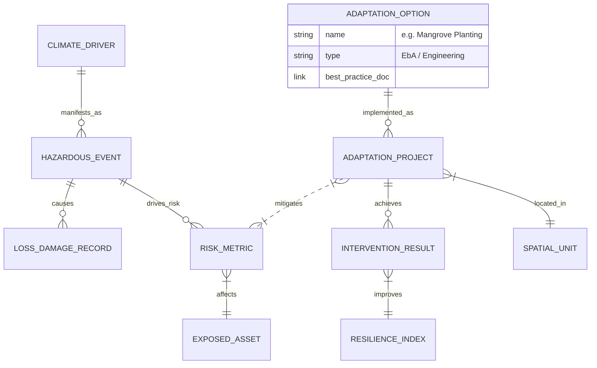

**Context**
1. Aligning with [[CRDB - TOR]] that states that National Climate Adaptation Information Framework, which the consultant must develop, needs to contain at least
	- Climate Data
	- Risk and Impact Assessment Data
	- Adaptation Guidelines and Examples
	- Adaptation Implementation Results
2. acknowledge stakeholder's requirements and existing DCCE data landscape. However, the associated data domains need to be excluded from NCAIF as our approach is based on the TOR and incrementalism

**The decision**
1. Excluded data domains
	You should treat these areas as **External Systems**. In the CDM, they should not be entity clusters; they should be single "Stub Entities" or simple ID references.

| **Domain to Exclude from CDM Detail**                                                                           | **Rationale**                                                                                                                                                                                                                             | **How to Handle It (The "Stub" Approach)**                                                                                                                                                                                                                           |
| --------------------------------------------------------------------------------------------------------------- | ----------------------------------------------------------------------------------------------------------------------------------------------------------------------------------------------------------------------------------------- | -------------------------------------------------------------------------------------------------------------------------------------------------------------------------------------------------------------------------------------------------------------------- |
| **Project Management & Budgeting**      _(Budget codes, Gannt charts, detailed M&E KPIs)_           | **Scope Creep:** The TOR asks for an "Information Framework," not a Project Management System. Building a schema to track budget drawdown or contractor performance (Div 1.2) is a massive undertaking that distracts from Risk Analysis. | **Do not model:** `PROJECT_BUDGET`, `CONTRACTOR`, `WORK_PACKAGE`.         **Do model:** A single `ADAPTATION_PROJECT` entity with a `External_System_ID` attribute. The CDM only cares _where_ the project is (Spatial) and _what risk_ it addresses. |
| **Content Management (CMS)**      _(Article authors, SEO tags, video formats, publishing workflow)_ | **Wrong Tool:** T-PLAT (Div 1.4) is a CMS. The Risk Database is for data. Modeling "Infographic Dimensions" or "Draft Status" inside the Risk CDM creates clutter.                                                                        | **Do not model:** `ARTICLE_VERSION`, `MEDIA_TYPE`, `PUBLISH_WORKFLOW`.         **Do model:** A simple `KNOWLEDGE_LINK` entity that acts as a URL pointer between a `HAZARD_EVENT` and the external T-PLAT document.                                   |
| **Granular GHG Inventory**      _(Emission factors, Tier 2/3 calculation formulas)_                 | **Duplication:** TGEIS (Div 2.1) already exists. Re-modeling the physics of methane emissions inside the Risk CDM ensures you will have two conflicting databases.                                                                        | **Do not model:** `EMISSION_FACTOR`, `FUEL_TYPE`, `GWP_VALUE`.         **Do model:** `EXPOSED_ASSET` with a `TGEIS_ID` reference. Let TGEIS handle the chemistry; the CDM handles the location and value.                                             |
| **CRM / Helpdesk**      _(User tickets, complaint status, login sessions)_                          | **Operational Noise:** FGD 1 requested "Two-way communication." This is a _software feature_, not a _data model core_. Modeling "Ticket Status" pollutes the scientific data model.                                                       | **Do not model:** `USER_SESSION`, `TICKET_HISTORY`, `COMPLAINT_CATEGORY`.         **Do model:** `OBSERVATION_RECORD` (The _data_ point submitted), but ignore the _workflow_ of how the department answers the email.                                 |
2. Grouping data entities into domains to align with TOR. This is the first draft

| **TOR Requirement**           | **CDM Subject Area**      | **Core Entities to Present**                                                                 |
| ----------------------------- | ------------------------- | -------------------------------------------------------------------------------------------- |
| **1. Climate Data**           | **Physical Climate**      | `CLIMATE_DRIVER` (Trends), `HAZARDOUS_EVENT` (Shocks), `CLIMATE_SCENARIO` (Projections).     |
| **2. Risk & Impact Data**     | **Risk & Loss**           | `EXPOSED_ASSET`, `RISK_METRIC` (Probabilistic), `LOSS_DAMAGE_RECORD` (Historical).           |
| **3. Adaptation Guidelines**  | **Knowledge & Options**   | `ADAPTATION_OPTION` (The Library of Solutions), `KNOWLEDGE_ASSET` (Best Practices/Manuals).  |
| **4. Implementation Results** | **Response & Resilience** | `ADAPTATION_PROJECT` (Where/What), `INTERVENTION_RESULT` (Outcome KPIs), `RESILIENCE_INDEX`. |

3. Overview of ERD of NCAIF according to the first draft above

